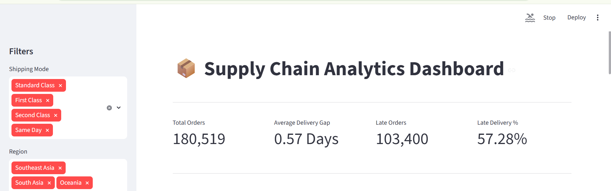
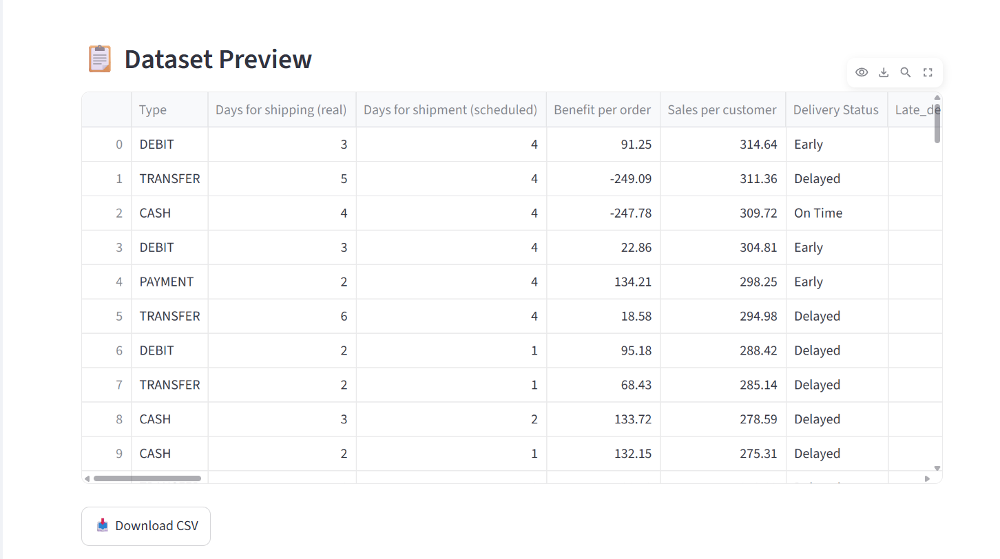
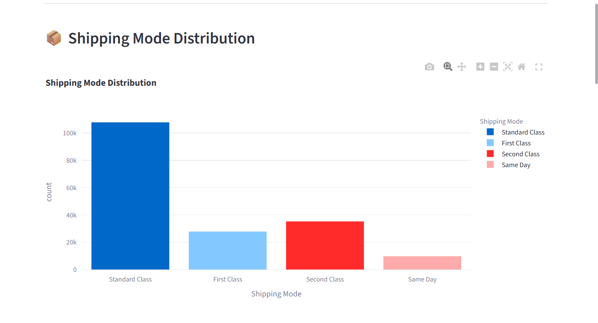
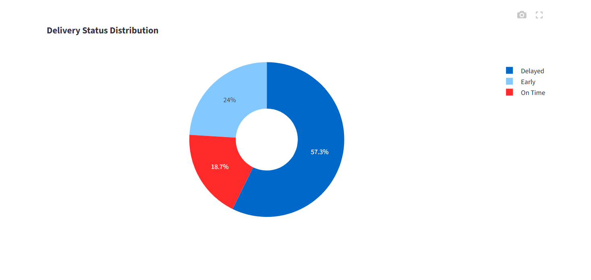
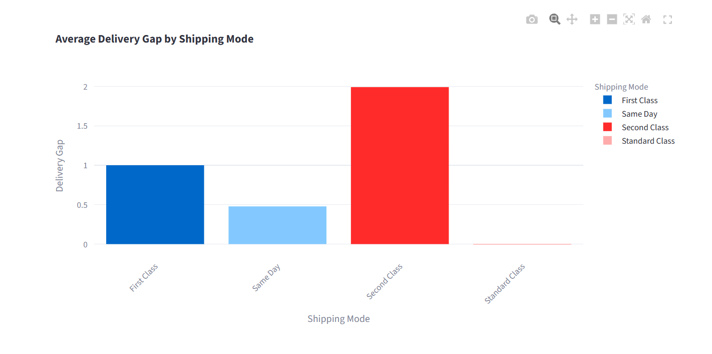
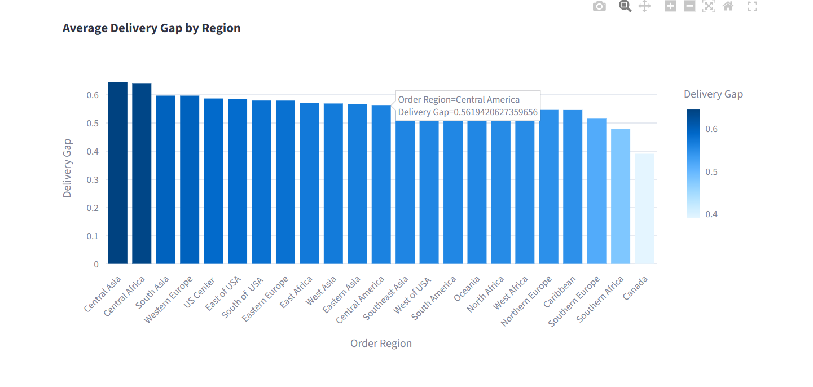

# 📦 Supply Chain Analytics Dashboard

A web-based interactive dashboard built using Python and Streamlit to analyze supply chain performance.

---

## 📊 Dashboard Preview



---

## 🚀 Features

- Interactive Dashboard
- Shipping Mode Analysis
- Delivery Status Analysis
- Delivery Gap Analysis
- Regional Performance
- Dataset Preview

---

## 📸 Dashboard Screenshots

### 🏠 1. Dashboard Home


---

### 📋 2. Dataset Preview



---

### 🚚 3. Shipping Mode Analysis



---

### 📦 4. Delivery Status Analysis



---

### ⏱️ 5. Delivery Gap by Shipping Mode



---

### 🌍 6. Delivery Gap by Region



---

## 🛠️ Tech Stack

- Python
- Streamlit
- Pandas
- Plotly
- NumPy

---

## 📂 Project Structure

```text
Supply_Chain_Analytics_Dashboard_Karan_Kumar_Soni/
│
├── app.py
├── README.md
├── requirements.txt
├── data/
└── images/
    ├── dashboard_home.png
    ├── dataset_preview.png
    ├── shipping_mode.png
    ├── delivery_status.png
    ├── Delivery gap by shipping mode.png
    └── Delivery gap by region.png
```

---

## ⚙️ Installation

```bash
git clone https://github.com/yourusername/Supply_Chain_Analytics_Dashboard_Karan_Kumar_Soni.git

cd Supply_Chain_Analytics_Dashboard_Karan_Kumar_Soni

pip install -r requirements.txt

streamlit run app.py
```

---

## 📈 Business Insights

- Compared shipping modes.
- Identified delivery delays.
- Analyzed regional performance.
- Evaluated delivery gap.
- Improved operational decision-making.

---

## 👨‍💻 Author

**Karan Kumar Soni**